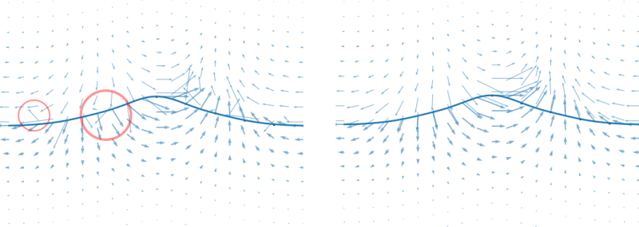

===========
Wave models
===========

All wave models are implemented in such a way that there is a crest at ``x=0``
at ``t = 0`` and the waves are traveling in the positive x-direction. The origin
of the coordinate system is on the sea floor, which is assumed to be horizontal.
The default acceleration of gravity is ``9.81``, so the input quantities should
be given in the SI system.

Airy
====

This is the simplest wave theory, a single cosine wave. It is included mostly
for testing the other models and is only valid in the limit of very low waves
in very deep water. 

Stokes
======

Stokes waves of 1st to 5th order are implemented following John D. Fenton's 1985
paper *A Fifth‐Order Stokes Theory for Steady Waves*. By increasing the 
requested order ``N``, the code will include more and more expansion
coefficients, starting from linear Airy waves at 1st order and properly
replicating 2nd, 3rd, 4th and finally 5th order Stokes waves. Any higher order
wave requested will issue a warning and return the fift order solution.

Stokes waves are good approximation in the deep water limit. No time consuming 
calculations are required to generate these waves and the computations will not
diverge. Both of these issues can be problematic for stream function waves that
need to optimize a non-linear function of many parameters.

Further details and analytical expression for all the coefficients in the 
perturbation expansion can be found in the original paper, available on `John D.
Fentons web pages <http://johndfenton.com/Papers/Papers-John%20Fenton.html>`_.

Fenton
======

Fenton stream function wave theory is a high order regular wave theory based on
truncated Fourier series approximating the stream function. This method of 
constructing non-linear regular waves was pioneered by Dean (1965). Our
implementation is based on Rienecker and Fenton's 1981 paper, *A Fourier 
approximation method for steady water waves*, which is often refered to as
"Fenton" stream function wave theory to differentiate it from the original
"Dean" stream function wave theory.

The method is based on collocation (solving the non-linear equations exactly in
N + 1 points) and is based on Newton–Raphson iterations to tackle the
non-linearities. The unknowns are the expansion coefficients :math:`B_j`, the
wave elevation :math:`\eta(x_m)`, the stream functions value at the free surface
:math:`Q` and the Bernoulli constant at the free surface :math:`R`.

The stream function a-priori satisfies the bottom boundary condition at z=0 and
also the Laplace equation :math:`\nabla^2\Psi=0`. It is defined as

.. math::

    \Psi(x, z) = B_0 z + \sum_{j=1}^{N}B_j\frac{\sinh jkz}{\cosh jkD}\cos jkx,

which is non-linear in :math:`\eta` on the free surface where :math:`z=\eta`. To
find the unknowns the following conditions are requested to be met:

- The free surface is a stream line, such that
  :math:`\Psi(x, \eta) = -Q`.
- The pressure is constant at the free surface
  (Bernoulli constant :math:`R`).
- The wave height is :math:`H`, such that
  :math:`\eta(0) - \eta(\lambda/2) = H`
- The mean wave elevation is :math:`D`, such that
  :math:`\int_0^{\lambda/2} \eta\,\mathrm d x = D \lambda / 2`. 

Further details and analytical expression for all terms of the Jacobian matrix
used in the Newton-iterations can be found in the original paper, available on
`John D. Fentons web pages
<http://johndfenton.com/Papers/Papers-John%20Fenton.html>`_.

.. #############################################################################

================
Air phase models
================

Raschii was origially written to provide good initial conditions for an exactly
divergence free two-phase Navier-Stokes solver based on DG-FEM, Ocellaris_. In
order to initialise the domain with a divergence free velocity field it is
important to also compute the velocities in the air phase in a consistent 
manner.

.. _Ocellaris: https://bitbucket.org/trlandet/ocellaris

ConstantAir
===========

The velocity in the air phase is horizontal with speed equal to the wave phase
speed. This is mostly usefull when using a blended total field, see
:ref:`sec_blending`.

FentonAir
=========

The Fourier series stream function from Rienecker and Fenton (1981) is used also
for the air phase. Using a stream function ensures an exactly divergence free
velocity field.

The "Fenton" stream function is linear in the unknown parameters when the wave
elevation is known. The air-phase velocities are computed after the water wave
has been established, so this means that the expansion coefficients
:math:`B_{1..N}` can be found by a simple linear solve to satisfy that the free
surface is a stream function also in the air phase. In order to use the "Fenton"
stream function the z-coordinate is flipped such that the velocity is purely
horizontal a distance ``depth_air`` above the free surface.

.. #############################################################################

.. _sec_blending:

=====================================
Combining the air and wave velocities
=====================================

         free surface

   Comparison of blended and unblended stream function velocities near the free
   surface. Fenton wave and FentonAir solution for wave heigh 12m, depth 200 m
   and wave length 100 m with an fifth order approximation and 100 m air layer.

The resulting velocity field can be seen on the left in the above figure. As can
be seen the velocities in the water and air phases are reasonably continuous,
but some discrepancies are highlighted. The divergence in the field is quite
high at the discontinuity when the combined water and air velocity field is
projected into a finite element space.

To combat these problems the two stream functions are blended together. The
stream function in the water domain is left entirely undisturbed, but from the
free surface and a distance :math:`\tau` up into the air—by default the same as
twice the wave height—the stream function in the water is smoothly transitioned
into the the stream function in the air. The results can be seen in the right
image. Since the blending is done to create a new stream function the resulting
velocity field is exactly divergence free. The resulting total stream function
and velocity components are

.. math::

    \Psi &= [1 - f(Z)] \Psi_{w}(x,z) + f(Z) \Psi_{a}(x,z),
    
    Z &= \frac{z - \eta(x)}{\tau},

    \mathbf{u}_x &= (1 - f) \frac{\partial\Psi_{w}}{\partial z} +
                    f \frac{\partial\Psi_{a}}{\partial z} -
                    \frac{d f}{d z}\Psi_{w}(x,z) +
                    \frac{d f}{d z}\Psi_{a}(x,z),

    \mathbf{u}_z &= -(1 - f) \frac{\partial\Psi_{w}}{\partial x} -
                    f \frac{\partial\Psi_{a}}{\partial x} -
                    \frac{d f}{d x}\Psi_{w}(x,z) +
                    \frac{d f}{d x}\Psi_{a}(x,z),

where the blending function :math:`f(Z)` is a constant equal to 0.0 in the water
and 1.0 above the air blending zone. Raschii uses a cubic Smoothstep_ function
in the blending zone. This function has zero first derivative at each end.

.. _Smoothstep: https://en.wikipedia.org/wiki/Smoothstep
